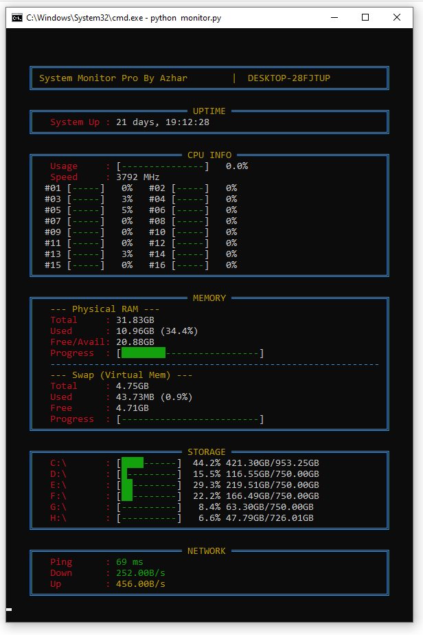

# 🖥️ Ultimate System Monitor Pro — Hardware Analysis Edition
By Md. Azharul Islam (@mdazharulislamnk)

Ultimate System Monitor Pro — Hardware Analysis Edition is a comprehensive, enterprise-grade hardware telemetry dashboard engineered to extract deep component details (Motherboard Model, CPU Temperature, Physical Drive Marketing Capacities, etc.) using advanced, low‑level OS scraping techniques while avoiding Administrator permission prompts (UAC) wherever possible. It presents rich diagnostics in a modern, responsive GUI and is packaged in this repository:

Repository: https://github.com/mdazharulislamnk/ultimate-system-monitor-GUI-hardware-analysis-edition

Main GUI script
- Filename: gui-hardwar-analysis-monitor.py
- Run: python gui-hardwar-analysis-monitor.py

> Note: Some sensors or OEM-locked platforms may still block access. The application exhausts multiple user-level probes to retrieve maximum information without requiring elevated privileges.

---

## 📸 Dashboard Preview
(Insert a high-resolution screenshot of the final GUI here showing CPU Temp, Motherboard, and a 4.0 TB drive)



Preview Options
- Manual screenshot (recommended)
  - Windows: Win+Shift+S → paste/save → move to assets/preview.png
  - macOS: Cmd+Shift+4 → save → move to assets/preview.png
  - Linux: Shift+PrtSc (GNOME) or your distro's screenshot tool → move to assets/preview.png
  - Recommended: PNG, ≥1280×720 (1920×1080 for high-res)
- In-app Export (if implemented)
  - Use any "Save Screenshot" UI action to export a framed PNG to assets/preview.png.
- Automated helper (optional)
  - Requires pyautogui and pillow: pip install pyautogui pillow
  - Example helper (preview_generator.py) can capture the active screen and save to assets/preview.png.

---

## 🚀 Engineering Triumph — Overcoming Windows Restrictions

This project demonstrates engineering tradeoffs and user-level techniques to surface hardware telemetry without UAC. The table below summarizes common problems and the non-elevated solutions used.

| Area | Challenge (Standard Tools) | Solution Applied | Rationale |
|---|---|---:|---|
| Motherboard / BIOS | Many APIs require Admin rights (UAC) | Read user-readable registry keys via winreg | Keys like `HKLM\HARDWARE\DESCRIPTION\System\BIOS` are often readable by normal users—no elevation required. |
| CPU Temperature | Sensors often return "N/A" due to OEM/driver locks | Multi-stage probe: WMI perf counters → WMIC/PowerShell scrape fallbacks | Performance counters are frequently readable; fallback scrapes increase success without escalation. |
| Storage Sizing | Marketing (decimal) vs binary (TiB) confusion | Custom conversion algorithm displays both Marketing (TB) and Binary (TiB) sizes | Users see the "box" size (4.00 TB) and the precise binary size (3.63 TiB). |
| UI Performance | Heavy I/O (network/disk/WMI) can block the GUI | Background threads isolate long-running operations | Keeps UI responsive by avoiding blocking the main thread. |

---

## 🔬 Deep Dive — Code Breakdown & Technologies

- Graphical Interface
  - customtkinter — Modern dark-themed UI components (rounded frames, progress bars, high-DPI friendly).
- System Telemetry
  - psutil — Core engine for CPU, memory, disk and network counters.
- Concurrency
  - threading — Runs expensive I/O (ping, WMI, disk scrapes) off the main loop.
- Registry Access (Windows)
  - winreg — Reads hardware-identifying keys available to standard users.
- Shell Scraping
  - subprocess — Executes WMIC / PowerShell commands when needed to fetch low-level details.
- Network Protocol
  - socket — Performs TCP-based latency checks (more reliable in restricted environments).
- Data Utilities
  - csv, io — Parse and write structured CSV logs for offline analysis.
- Core Utilities
  - math, datetime — Binary ↔ Decimal conversions and uptime calculations.

---

## 🚀 Detailed Feature Set

CPU & Thermal Monitoring
- CPU Model: Exact marketing name (e.g., Intel Core i7-10700K).
- Clock Speed: Live CPU frequency (MHz).
- Per-Core Utilization: Visual bars and exact percentages for each logical core.
- Dynamic Temperature: Current CPU temperature in °C (where readable).

Memory Subsystem
- RAM Info: Attempts to report RAM stick manufacturer, part number, and rated speed when available.
- Physical RAM: Total / Used / Available.
- Virtual Memory (Swap): Pagefile monitoring to detect heavy paging.

Storage & Disk Health
- Physical Drives: Lists detected devices (model strings) with marketing capacities (e.g., 4.00 TB).
- Logical Partitions: Live usage % and used/total GB values for each partition.
- Binary ↔ Decimal: Both TiB and TB shown to explain capacity differences.

Network & System Health
- Real-Time Throughput: Upload / Download speeds (KB/s or MB/s).
- Ping Latency: TCP-based ping to configurable host (default: 8.8.8.8).
- System Health Score: Composite 0–100 score based on CPU, RAM, and network stability.
- Uptime: Precise system running time.

Data Export
- Optional CSV: timestamp, cpu_total_pct, per-core values, ram_used_mb, ram_total_mb, swap_used_mb, net_up_bps, net_down_bps, ping_ms, drive sizes.

---

## 🛠️ Installation & Getting Started

### Prerequisites
- Python 3.7 or higher
- pip

### Step 1 — Clone the repository
```bash
git clone https://github.com/mdazharulislamnk/ultimate-system-monitor-GUI-hardware-analysis-edition.git
cd ultimate-system-monitor-GUI-hardware-analysis-edition
```

### Step 2 — Install Dependencies
```bash
pip install customtkinter psutil
```
(Optionally for preview helper: pip install pyautogui pillow)

### Step 3 — Run the Application
```bash
python gui-hardwar-analysis-monitor.py
```
The GUI will auto-size/position using constants in the script (or values from `config.json` if implemented) and begin collecting telemetry.

---

## Configuration & Tuning

Open `gui-hardwar-analysis-monitor.py` and edit the CONFIGURATION block (top of the file) to tune:

Window & Position
```python
WINDOW_WIDTH = 1200
WINDOW_HEIGHT = 900
WINDOW_X = 100
WINDOW_Y = 100
```

Refresh & Performance
```python
REFRESH_RATE_MS = 1000  # 1000 ms = 1 second
LOGGING_ENABLED = False
PING_TARGET = "8.8.8.8"
```

Storage Display
- The script displays both marketing (decimal TB) and binary (TiB) sizes. Toggle or format these in the code if you prefer a single representation.

Optional config.json
- If present, `config.json` can override defaults (refresh_rate_ms, ping_target, show_per_core, logging_enabled, thresholds, colors). The app will prefer JSON values when available.

---

## 🔧 Troubleshooting

- Temperature shows "N/A"
  - Likely hardware/BIOS/driver locks. The app tries multiple non-elevated probes—if all fail, sensor is inaccessible at user-level.
- Motherboard details missing
  - Virtual machines and highly locked OEM systems sometimes omit registry keys. Physical hardware usually exposes these keys.
- Ping fails but internet works
  - Firewall/antivirus may block outbound sockets—allow Python or change `PING_TARGET`.
- Window off-screen or too large
  - Edit `WINDOW_X`, `WINDOW_Y`, `WINDOW_WIDTH`, `WINDOW_HEIGHT`.
- Module import errors
  - Fix with: pip install customtkinter psutil

---

## Security & Privacy Notes

- Reads only non-elevated system data by default; no privilege escalation performed.
- CSV logs may contain hardware identifiers—treat exported logs as sensitive.
- Audit telemetry/remote endpoints before distributing internally.

---

## Contributing

Contributions, bug reports, and feature requests are welcome.

Suggested workflow:
1. Fork the repository
2. Create a branch: git checkout -b feature/your-feature
3. Commit & push
4. Open a pull request with sample outputs

Please include tests or example recordings for new telemetry probes.

---

## 👨‍💻 Author

Md. Azharul Islam  
GitHub: https://github.com/mdazharulislamnk  
LinkedIn: Md. Azharul Islam

---

## 📜 License

This project is released under the MIT License. See LICENSE for details.